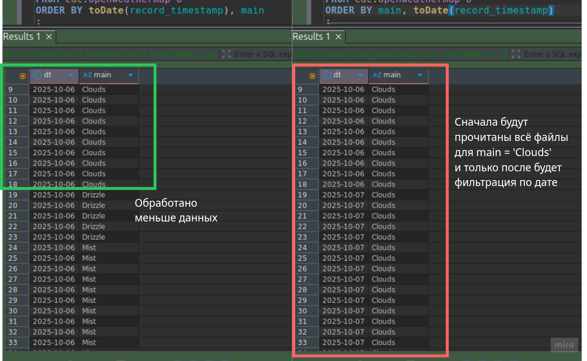

Превратности ХХХ BY


Разрываем осеннюю непогоду 🍁 заметками про Clickhouse: немного наюнсов, связанных PARTITION BY и ORDER BY

Чуть-чуть тема затронута в [посте О-Optimization](https://t.me/double_data/129), там дан инструмент для поиска 
неоптимальности при запросах в Clickhouse.

Зачем все эти BY:
- PARTITION BY - ключ партицирования = физическое разделение данных на дисках, то данные для
разных партиций хранятся отдельно, это даёт 2 положительных эффекта:
  - Partition pruning - техника, которая при построении плана запроса позволяет пропускать не нужные партции (которые не содержат запрашиваемых данных) -> меньше данных -> выше эффективность запроса
  - обновление данных - возможно управлять сразу всей партицией (удалять DROP, обновлять\заменять\перемещать REPLACE/MOVE) 
- ORDER BY:
  - побочный эффект - данные отсортированы в указанном порядке -> некоторые агрегаты, join, оконки будут работать быстрее
  - skipping indexes (скипающие индексы) - при построении плана запроса позволяют пропускать гранулы (блоки строк) -> меньше данных -> выше эффективность запроса

Подробности в доке [partitions](https://clickhouse.com/docs/ru/partitions), [order-by](https://clickhouse.com/docs/sql-reference/statements/select/order-by), а нас будут интересовать детали, которые никто и нигде не напишет, 
если только шепотом расскажет 🤫
.
Выше показано, что и PARTITION и ORDER могут быть использованы для эффективной фильтрации данных в запросах, но порой можно 
сильно споткнуться на этом:
- партиции есть, а запрос долгий
- индекс есть, а запрос долгий
- и даже поля из партиций и индексов используются в WHERE, а всё равно долго

В предыдущем посте показано как узнать о неоптимальности своего запроса = сравнить два вывода:
```sql
explain estimate select * from your_table
vs
explain estimate select * from your_table where ..... -- ваши условия
```

Если цифры в обоих случаях идентично, то что-то явно идет не так....
.

1️⃣ Поле партицирования: то, да не то!

Задать выражение для партиций можно множеством способов, например:
- года (toYYYY(..) или toStartOfYear)
- месяца (toYYYYMM(..) или toStartOfMonth)
- недели
- дни (можно явно report_date, можно неявно toDate(report_date))

Некоторые преобразования линейные (не меняют тип данных в зависимости от типов до и после, например, toDate или toStartOfWeek, по факту транкейт даты)
нелинейные (меняют тип данных, но смысл остается тем же, например, toYYYYMM).

Выбор поля партиционирования и выражения для него влияют на использование механизма Partition pruninng или нет: для нелинейных преобразований механизм не будет использован ☝️ 
Например, ddl:

```sql
PARTITION BY toYYYYMM(report_date)
```

Пользовательские запросы любых видов используются фильтрацию report_date или иные преобразования будут неэффективны, например:

```sql
select *
from your_table
where toDate(report_date) >= ....
-- toStartOfWeek(date) = ....
и тд
```

Хотя с точки зрения пользователя может наблюдаться явное непонимание, особенно когда фильтрация явно указывается по году (`report_date >= toDate('2025-01-01'')`).

Второй распространенный кейс (из области мисскоммуникаций): выражение в партиции использует datetime + в самой таблице есть явное поле date:

```sql
PARTITION BY toDate(report_datetime)
```

Пользователь может совершать логическую ошибку: использование report_date (партиции же по дням).

☝️ Описанное выше протестировано локально на clickhouse-server:25.9.2.1 и проблемы описанные с нелинейными преобразованиями не удалось вопроизвести, хотя есть рабочий r&d (для версии 24.3), подтверждающий, что  
нелинейные преобразования отключают Partition pruning. Одно можно сказать точно:
- использование при фильтрации преобразования аналогично указанному в DDL даёт 100% гарантию эффективной фильтрации ✅

2️⃣ Сортировка, не всё хорошо, что упорядочено!

При создании таблицы указывается набор полей по которым данные будут отсортированы и по которым создадутся индексы.

```sql
ORDER BY (param1, param2, ...., paramN)
```

А что здесь-то интересного:
- кол-во (можно же и 1 и 100500)
- выбор самих параметров (а чего выбирать-то? типы, категории, время, ...)
- взаимное расположение (что за чем должно следовать)

А что выбрать:
- обычно выбирают те, поля по которым таблица чаще всего фильтруется (у нас же индексы есть)

Кол-во полей:
- в пределах разумного, 3-5. Большое кол-во замедляет вставку + вызывает фоновый процесс мержей (нагружает CPU).

Хороший алгоритм для заполнения ORDER BY есть у [altinity](https://kb.altinity.com/engines/mergetree-table-engine-family/pick-keys/)

Как расположить:
- дока говорит, что следует располагать поля по уменьшению кардинальности (то есть поля с меньшим кол-вом уникальных значений должны быть левее, например, пол, ос, страна и др) - это верно, тк при использовании такой фильтрации кол-во читаемых данных уменьшается минимум на 50%
- altinity добавляет: поля наиболее часто используемые при фильтрации следует располагать левее (например, дата)

Возникает противоречение: уникальных дней больше чем значений пола, но по дате фильтруются чаще -> в общем случае рекомендация будет такой:
сначала располагаем, что по чему чаще фильтруемся, далее в порядке уменьшения кардинальности, то есть для примера выше

```sql
ORDER BY (report_date, gender, ....)
```

На самом деле работать может и любая другая комбинация (gender, country, report_date, ...) или еще хуже (gender, country, ...., report_date) - главным критерием является 
взаимное распределение значений, иными словам:
- за каждый день отчета есть все значения пола и все страны и их распределения между днями не различаются, то вариант с датой, указанной первой - ваш выбор 👍
- а вот если распределение день ото дня различается, то надо ресерчить - готовых решений нет.

Можно предложить визуальный пример: данные в файлах сортируются сначала по одному первому атрибуту, после по 2 и тд и при
одной и тоже фильтрации WHERE dt = '2025-10-06' and main = 'Clouds' будет прочитано разное кол-во строк:



tags:
- #clickhouse
- #partition_by
- #order_by
