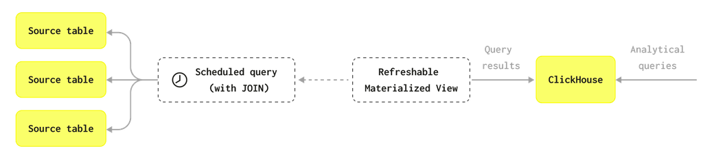

# Refreshable materialized view


.
💣 Что еще за Refreshable MV ? 

Ранее были рассмотрены materialized view:
- [MV 1](https://t.me/double_data/124)
- [MV 2](https://t.me/double_data/128)

`Clickhouse MV` - аналог из мира реляционных СУБД - триггеры, некий код который запускается в момент вставки блока данных в таблицу. Обычно MV выполняеют роль
первичного processing данных (фильтрация некорректных значений, преобразование структуры (например из JSON -> FLAT) и др) со вставкой в целевую таблицу.

Начиная с версии Clickhouse 23.12 функционал MV расширили (скорее не расширили, а подвезли новый функционал 🚀):
- `Refreshable materialized view (RMV)` - это материализованные представления из мира реляционных субд, но с присущей Clickhouse изюминкой `refreshable` -> у них есть cron, 
то есть они могут запускаться по расписанию - и это открывает отличные возможности по построению пайплайнов обработки.

За подробностями в [доку](https://clickhouse.com/docs/materialized-view/refreshable-materialized-view) 🧐
.
Для рассмотрения MV у нас был pipeline (переходим по ссылкам выше), кратко:
- python код который запускал запрос в Clickhouse, сам python код запускался каждые 5 минут Airflow (подошел бы и cron)

Брюки превращаются, брюки превращаются....:

```sql
CREATE MATERIALIZED VIEW cdc.openweathermap_raw_refreshmv
REFRESH EVERY 1 minute APPEND -- магия здесь 🧙‍♀️
TO cdc.openweathermap_raw -- приемная таблица осталась прежней
AS
SELECT record_timestamp,
	   record_value
FROM (
SELECT toDateTime(now(), 'Europe/Moscow') AS record_timestamp, *
FROM url('https://api.openweathermap.org/data/2.5/weather?lat=%(lat)s&lon=%(lon)s&appid=%(appid)s&units=metric',
	JSONAsString, 'record_value String')
);
```

Пайплан стал проще (выкинули шедулер Airflow или cron, не выкинули, конечно, а его расположение переместилось внутрь Clickhouse): 
RMV выполняет запрос каждую минуту (`EVERY 1 minute`) и добавляет данные в целевую таблицу `APPEND`.

Из возможностей:
- задание интервала выполнения (`EVERY X <interval>`)
- без указания таблицы-приемника нельзя
- `APPEND` \ без указания - добавляете записи в таблицу или перезаписываете данные в таблице

Интересен второй сценарий (перезапись данных), создаем RMV (без `APPEND`) и таблицу-приемник с `_v2` (cdc.openweathermap_raw_refreshmv_v2, cdc.openweathermap_raw_v2)
и лезем в лог запросов `system.query_log`:

```sql
select type
	, event_date
	, event_time
	, query
	, tables
	, query_kind
	, ql.used_privileges 
from system.query_log ql 
where event_date >= today()
and hasAny(['cdc.openweathermap_raw_refreshmv_v2'], tables)
and type = 'QueryFinish'
order by event_time desc
limit 1
```

Что интересного:
- выполняемый запрос:
```sql
INSERT INTO cdc.`.tmp.inner_id.26366163-063f-4761-a990-ce80bd4253cf`
...
```

Ага, Clickhouse вставляет данные во временную таблицу, но как данные по падают в целевую ??

- список прав для выполнения запроса немного проясняет что происходит под капотом

```
SELECT, DROP TABLE ON cdc._tmp_replace_f572fcd715528ac1_vyyrigbhb769007a
INSERT, CREATE TABLE ON cdc.`.tmp.inner_id.26366163-063f-4761-a990-ce80bd4253cf`
SELECT, INSERT, CREATE TABLE, DROP TABLE ON cdc.*
TABLE ENGINE ON MergeTree
CREATE TEMPORARY TABLE ON *.*
INSERT(record_timestamp, record_value) ON cdc.`.tmp.inner_id.26366163-063f-4761-a990-ce80bd4253cf`
```

Очень интересно, но ничего не понятно 🙃, на этом копание пока остановим, примерный сценарий:
- пересоздание временной таблицы
- вставка во временную таблицу
- replace данных в целевой таблице

Для любого сценария существует команда принудительного обновления:

```sql
SYSTEM REFRESH VIEW <rmv_name>;
```

----------------------------------------------

Ну как мне всё это мониторить 🖥

Для просмотра статуса по RMV существует системная таблица `system.view_refreshes`, дает представление:
- какие RMV есть
- последний успешный рефреш
- следующий рефреш
- ошибки
- и др.

Ошибки всегда интересно:
- удаляем таблицу-приемник _v2
- принудительно рефрешим `cdc.openweathermap_raw_refreshmv_v2`
- смотрим в мониторинг

```sql
SELECT exception
FROM system.view_refreshes
where view = 'openweathermap_raw_refreshmv_v2';

-- Code: 390. DB::Exception: Table `openweathermap_raw_v2` doesn't exist.
```

Бинго 😎.

Вот такой новый функционал Clickhouse, следующим шагом ожидаем cron по расписанию ? (и Airflow уже больше не нужен 😉). 
Признавайтесь используете: MV и\или RMV ?

tags:
- #clickhouse
- #refreshable_materialized_view


